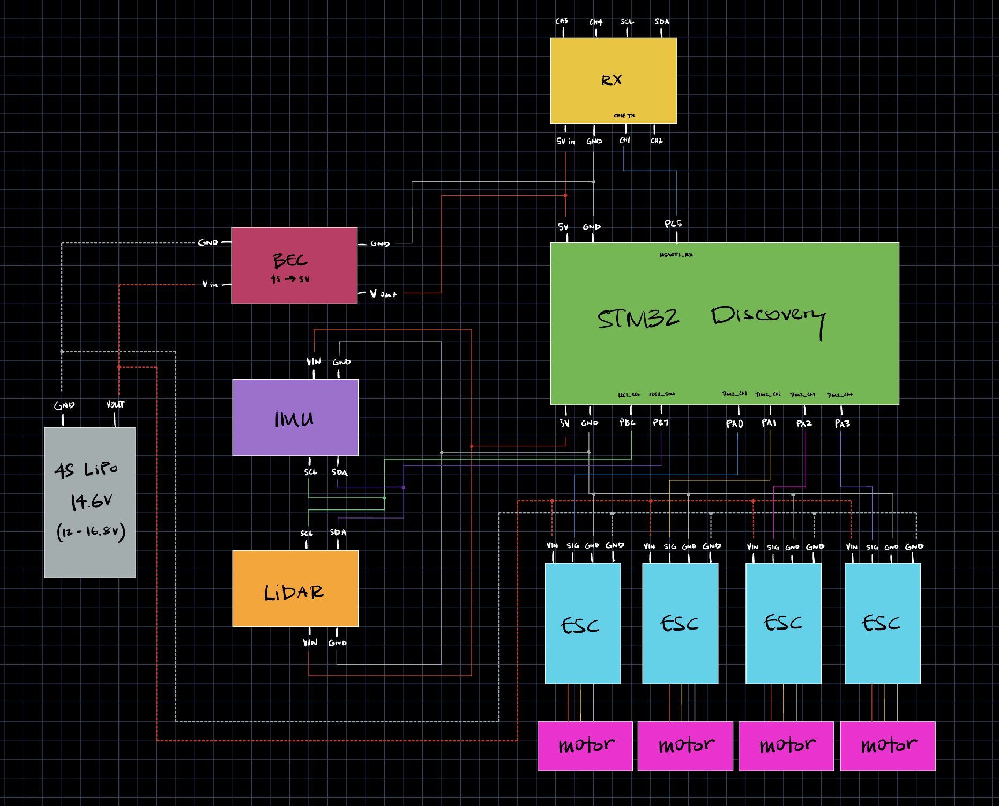

Generate build files:  
`cmake -B build -S ./`  
Compile:  
`cmake --build build`  
Flash to board:  
`cmake --build build --target flash_project`  


# ECE-5780-Project-GBJCTS: Simple Quadcopter
This is the final project for an embedded systems design course.

This project involves developing a simple quadcopter to demonstrate proficiency in communication protocols, system control, as well as sensor and actuator integration and actuation.

Weekly Milestones:
1. Development Environment & Hardware Setup
2. IMU Sensor Interface
3. Altitude Sensor Interface
4. Radio Receiver Interface
5. ESC Control and Motor PWM Output
6. Feedback Control Implementation
7. Final System Integration & Flight Testing


## Hardware Components
**Flight Controller:** STM32F072 Discovery Board  
**IMU:** LSM6DS3 on a NOYITO breakout board  
**Altitude Sensor:** VL53L1X on an Adafruit breakout board  
**Radio:** Team BlackSheep Crossfire Nano  
**ESCs:** XILO 40A BLHeli_S ESC  
**Motors:** EMAX ECO II 2207 2400KV  
**Power:** 4S LiPo battery  
**Voltage Regulator:** MatekSys Micro BEC  

**Quadcopter Frame:** GEPRC GEP-Mark4 5"  
**Propellers:** HQProp Ethix S3  

<p align="center" style="display: flex; justify-content: center; gap: 50px;">
  
</p>

## Features & Progress

### Planned
- radio controlled thrust input (altitude control)
- stable flight (pitch and roll axes)
- fixed altitude hover

### Current Progress
- Simulator and optimizer to tune PIDs in 4 axes
- Control over motors demonstrated


## Toolchain
This project uses a bare-metal embedded toolchain based on GCC, CMake, and OpenOCD.

### Required Tools
- **GNU ARM Embedded Toolchain** (compiler)  
- **CMake** (build system)  
- **OpenOCD** (flashing/debugging)  
- **ST-Link** (hardware debug probe)

### Toolchain Installation

#### macOS
[Install Homebrew](https://brew.sh/) if needed.

```bash
brew install --cask gcc-arm-embedded
brew install cmake
brew install openocd
brew install stlink
```

#### Linux
```bash
sudo apt update
sudo apt install gcc-arm-none-eabi
sudo apt install binutils-arm-none-eabi
sudo apt install cmake
sudo apt install openocd
sudo apt install stlink-tools
```

#### Windows
Recommended to use Windows Subsystem for Linux. [Install WSL](https://learn.microsoft.com/en-us/windows/wsl/install) and use the Linux instructions above.  

### Build & Flash
Generate build files:  
`cmake -B build -S ./` (regular build)  
`cmake -B build -S ./ -DCMAKE_BUILD_TYPE=Debug` (build and include debug symbols for GDB)  
Compile:  
`cmake --build build`  
Flash to board:  
`cmake --build build --target flash_project`


## Project Info
**Status:** Not Functional  
**Language:** C  
**License:** MIT License – see [LICENSE](./LICENSE)  
**Authors:** [G. Bostram](https://github.com/GunnarBostrom), [J. Canada](https://github.com/JC919), [T. Stratton](https://github.com/POACH3)  
**Semester:** Spring 2026  
**Start Date:** 17-MAR-2026